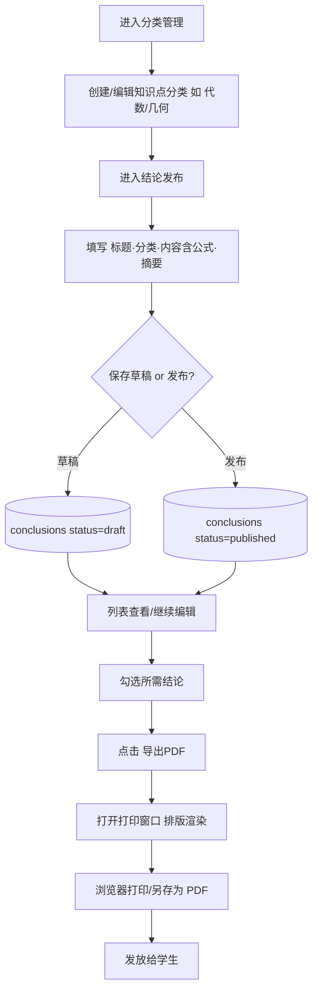
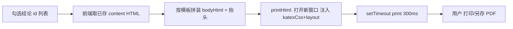

# 二级结论发布与管理 — 设计文档

> 适用范围：数学老师综合管理后台（单用户、个人使用场景）
> 技术栈背景：前端 Vue 3 + Vite + Element Plus + Tiptap(富文本) + KaTeX(公式) + ECharts；
> 后端 Node + Express + Sequelize + MySQL。
> 本文为**设计文档，不含实现代码**，用于明确功能边界、数据模型、模块划分与导出逻辑，供开发直接参考。

---

## 1. 功能概述

### 1.1 什么是「二级结论」
在数学中，「二级结论」指由基本定理/公式**进一步推导出的、可当作「小定理」直接引用**的结论（如「等腰三角形三线合一」「中点四边形性质」等）。教师常将其整理后发给学生，帮助其跳过重复推导、直接运用。本功能即用于**发布、分类管理、导出**这类结论。

### 1.2 功能目标

| 目标 | 说明 |
| --- | --- |
| 结论发布 | 录入标题、所属知识点、详细内容（含公式与说明），发布至系统供查看。 |
| 分类管理 | 按知识点（代数、几何、函数…）创建/编辑/维护分类，便于组织与检索。 |
| 选择导出 | 在列表中勾选所需结论，排版后导出 PDF，发放给学生。 |
| 轻量易用 | 契合个人使用场景，复用现有富文本与公式能力，无需复杂权限。 |

### 1.3 与现有系统的关系（复用点）
- **富文本 + 公式**：直接复用 `client/src/components/RichEditor.vue`（Tiptap + `math-extension.ts` + KaTeX），结论 `content` 以含 katex span 的 HTML 存储，与题库题干一致。
- **PDF 导出**：复用既有模式——`homework/HomeworkList.vue` 与 `question/KnowledgeQuestions.vue` 中的 `window.open` + 注入 `katex.min.css?raw` + 兜底换行样式 + `setTimeout(print)`。本功能将其抽为公共 `utils/printHtml.ts` 复用。
- **索引建法**：新表索引沿用「原生 DDL 在 sync 后补建」方式（见 `server/src/utils/ensureIndexes.js`），规避 `underscored` 下 alter 索引缺陷。
- **响应包络**：沿用 `utils/response.js` 的 `{ code, message, data }`。

---

## 2. 核心数据模型

### 2.1 知识点分类表 `knowledge_categories`

| 字段 | 类型 | 必填 | 说明 |
| --- | --- | --- | --- |
| id | INT (PK) | 是 | 分类唯一标识 |
| name | VARCHAR(50) | 是 | 分类名（代数/几何/函数/概率…） |
| parentId | INT (NULL) | 否 | 父分类 id，支持二级嵌套（如 代数 > 方程） |
| sort | INT | 否 | 展示排序，默认 0 |
| remark | VARCHAR(255) | 否 | 备注 |
| createdAt / updatedAt | DATETIME | 是 | Sequelize 自动维护 |

### 2.2 二级结论表 `conclusions`

| 字段 | 类型 | 必填 | 说明 |
| --- | --- | --- | --- |
| id | INT (PK) | 是 | 结论唯一标识 |
| title | VARCHAR(200) | 是 | 结论标题 |
| categoryId | INT (FK→knowledge_categories.id) | 是 | 所属知识点分类 |
| content | TEXT | 是 | 详细内容（富文本 HTML，含 katex 公式与说明） |
| summary | VARCHAR(500) | 否 | 一句话结论 / 摘要，便于列表与 PDF 速览 |
| level | ENUM('primary','secondary') | 否 | 结论层级，默认 `secondary`（本功能聚焦二级，预留一级） |
| status | ENUM('draft','published') | 否 | 发布状态，默认 `draft`；发布后学生可见 |
| tags | VARCHAR(255) | 否 | 关键词，逗号分隔，便于检索 |
| createdAt / updatedAt | DATETIME | 是 | Sequelize 自动维护 |

### 2.3 字段说明与约束
- **content 存储格式**：与题库题干一致，保存 Tiptap 产出的 HTML，数学公式已渲染为 katex span，导出 PDF 时只需注入 katex CSS 即可正确显示。
- **唯一/必填**：`title` + `categoryId` 必填；`content` 非空校验（去除空格/标签后判断）。
- **物理列名注意**：全局 `underscored: true`，模型用 camelCase（`categoryId`/`createdAt`）→ 物理列 `category_id`/`created_at`。索引、联表均按物理列书写。
- **索引（原生 DDL 补建，写进 `ensureIndexes.js`）**：
  - `knowledge_categories(name)`
  - `conclusions(category_id)`
  - `conclusions(status)`
  - `conclusions(title)`（关键词模糊检索加速）

---

## 3. 系统模块划分

| 层 | 模块/文件（建议） | 职责 |
| --- | --- | --- |
| 数据模型层 | `server/src/models/KnowledgeCategory.js`（新增） | 定义分类表结构 |
| 数据模型层 | `server/src/models/Conclusion.js`（新增） | 定义结论表结构（关联 categoryId） |
| 索引补建 | `server/src/utils/ensureIndexes.js`（修改） | 追加两张新表的索引（原生 DDL） |
| 控制器层 | `server/src/controllers/category.controller.js`（新增） | 分类 CRUD、树形返回 |
| 控制器层 | `server/src/controllers/conclusion.controller.js`（新增） | 结论 CRUD、发布/撤下、列表（筛选+分页）、检索 |
| 路由层 | `server/src/routes/category.routes.js`（新增） | `/api/categories` 端点 |
| 路由层 | `server/src/routes/conclusion.routes.js`（新增） | `/api/conclusions` 端点 |
| 前端 API 层 | `client/src/api/category.ts`（新增） | 封装分类请求（复用 `request.ts`） |
| 前端 API 层 | `client/src/api/conclusion.ts`（新增） | 封装结论请求 |
| 富文本组件 | `client/src/components/RichEditor.vue`（复用） | 结论内容编辑（含公式） |
| 展示组件 | `client/src/components/RichContent.vue`（复用） | 列表中渲染 HTML + 公式 |
| 打印工具 | `client/src/utils/printHtml.ts`（新增，提取公共） | 统一 `window.open` + katex CSS + print 逻辑 |
| 分类页 | `client/src/views/conclusion/CategoryManage.vue`（新增） | 分类树创建/编辑/删除 |
| 列表页 | `client/src/views/conclusion/ConclusionList.vue`（新增） | 列表、筛选、多选、导出按钮 |
| 编辑/发布页 | `client/src/views/conclusion/ConclusionEdit.vue`（新增） | 表单 + RichEditor + 保存草稿/发布 |

---

## 4. 用户操作流程



### 4.1 分类管理
- 列表以树形展示（支持 `parentId` 二级嵌套）。
- 提供「新建分类 / 重命名 / 删除（有子项或已关联结论时禁止或级联提示）」。

### 4.2 结论发布
- 表单字段：标题、所属分类（级联选择）、详细内容（RichEditor，支持公式与图文）、摘要、标签、层级（默认二级）。
- 操作：「保存草稿」「发布」。发布后进入 visible 列表；草稿仅自己可见。

### 4.3 维护与导出
- 列表支持按分类、状态、关键词筛选；支持多选勾选。
- 选中后「导出 PDF」触发打印窗口。

---

## 5. PDF 导出逻辑

### 5.1 方案（复用既有 print 模式，抽为公共工具）
沿用 `HomeworkList.vue` / `KnowledgeQuestions.vue` 的成熟做法，抽成 `client/src/utils/printHtml.ts`：

```ts
// 伪代码示意（非实现）
import katexCss from 'katex/dist/katex.min.css?raw'
const katexWrapCss = '.katex{...换行兜底...}.katex-display{...}'
export function printHtml(title: string, bodyHtml: string) {
  const win = window.open('', '_blank', 'width=900,height=700')
  win.document.write(
    `<html><head><meta charset="utf-8"><title>${title}</title>` +
    `<style>${katexCss}${katexWrapCss}${layoutCss}</style></head>` +
    `<body>${bodyHtml}</body></html>`
  )
  win.document.close()
  setTimeout(() => win.print(), 300)
}
```

### 5.2 排版模板（学生发放版，干净无编辑控件）
对勾选的每条结论，渲染为卡片：
```
┌─ 《结论标题》                      知识点：几何
│  摘要：一句话结论…
│  ─────────────────────────────
│  [详细内容 HTML，含公式与说明]
└─────────────────────────────────
```
- 每条结论之间 `page-break-after: always`（或连续排版，由「每页一条」开关控制）。
- 顶部可加一个统一抬头（如「数学二级结论汇编 · 2026 春」），由导出时填写。

### 5.3 公式渲染
- 结论 `content` 已是含 katex span 的 HTML，打印窗口注入 `katex.min.css?raw` 即可正确显示。
- `katexWrapCss` 提供换行兜底（`white-space:normal; overflow-wrap:break-word`），防止长公式溢出。
- 无需再次调用 `renderMathInElement`（公式在编辑期已由 math-extension 渲染为 span）。

### 5.4 导出流程


### 5.5 可选增强（非 MVP）
- 若需服务端落盘 PDF，可加 `POST /api/conclusions/export` 用 puppeteer 渲染；但个人场景前端 print 足够，首版不引入新依赖。

---

## 6. 接口设计

统一响应包络：`{ code, message, data }`（成功 `code:0`）。

### 6.1 分类接口 `/api/categories`
| 方法 | 路径 | 说明 | 关键参数/返回 |
| --- | --- | --- | --- |
| GET | `/` | 列表（树形） | 返回嵌套分类数组 |
| POST | `/` | 新建 | `{ name, parentId?, sort?, remark? }` |
| PUT | `/:id` | 编辑 | 同上（部分字段） |
| DELETE | `/:id` | 删除 | 有关联结论时返回提示 |

### 6.2 结论接口 `/api/conclusions`
| 方法 | 路径 | 说明 | 关键参数/返回 |
| --- | --- | --- | --- |
| GET | `/` | 列表（筛选+分页） | `?categoryId=&status=&keyword=&page=&pageSize=` → `{ list, total }` |
| POST | `/` | 新建 | `{ title, categoryId, content, summary?, level?, tags?, status? }` |
| GET | `/:id` | 详情 | 单条结论 |
| PUT | `/:id` | 更新 | 同上（部分字段） |
| DELETE | `/:id` | 删除 | — |
| PATCH | `/:id/status` | 发布/撤下 | `{ status: 'published' \| 'draft' }` |

> 说明：导出为前端行为，不强制后端接口；若后续做服务端 PDF，再补 `POST /api/conclusions/export`。

---

## 7. 页面设计说明

### 7.1 分类管理页 `CategoryManage.vue`
- 左侧分类树（Element Plus `el-tree` 或自定义），右侧编辑表单。
- 操作：新建子分类 / 重命名 / 删除；删除前校验是否含子项或已关联结论。

### 7.2 结论列表页 `ConclusionList.vue`
- 顶部筛选栏：`el-select` 分类、`el-select` 状态（全部/草稿/已发布）、`el-input` 关键词。
- 表格列：勾选框、`el-table-column` 标题、分类名、层级、状态标签（`el-tag`）、更新时间、操作（编辑/删除/预览）。
- 底部批量操作：「导出 PDF」（基于勾选项）。

### 7.3 结论编辑/发布页 `ConclusionEdit.vue`
- 表单：`el-form` + `el-input`(标题) + 分类级联选择 + `RichEditor`(内容) + `el-input`(摘要) + `el-input`(标签)。
- 底部按钮：「保存草稿」「发布」「预览」。
- 内容区复用 `RichEditor.vue`，公式编辑体验与题库一致。

### 7.4 打印/预览（无独立路由）
- 由列表页「导出 PDF」调用 `printHtml` 打开新窗口，按第 5.2 模板渲染，学生视角干净排版。

---

## 8. 关键设计取舍与非功能

- **复用优先**：富文本/公式/PDF 打印全部复用既有能力，零新重依赖。
- **content 存 HTML**：与题库统一，避免再引入 Markdown/LaTeX 渲染链路。
- **草稿/发布分离**：`status` 区分，发布即对学生可见（如有学生端），草稿不外露。
- **索引原生 DDL**：新表索引写入 `ensureIndexes.js`，规避 alter 索引缺陷（前次已验证）。
- **校验**：标题/分类/内容必填，后端二次校验；分类删除做关联保护。
- **轻量**：单用户无鉴权需求；导出为前端 print，不占后端资源。

---

## 9. 开发参考清单

新增文件：
- `server/src/models/KnowledgeCategory.js`
- `server/src/models/Conclusion.js`
- `server/src/controllers/category.controller.js`
- `server/src/controllers/conclusion.controller.js`
- `server/src/routes/category.routes.js`
- `server/src/routes/conclusion.routes.js`
- `server/src/utils/ensureIndexes.js`（修改：追加索引）
- `client/src/api/category.ts`
- `client/src/api/conclusion.ts`
- `client/src/utils/printHtml.ts`（提取公共打印逻辑）
- `client/src/views/conclusion/CategoryManage.vue`
- `client/src/views/conclusion/ConclusionList.vue`
- `client/src/views/conclusion/ConclusionEdit.vue`

复用文件：
- `client/src/components/RichEditor.vue`、`RichContent.vue`、`math-extension.ts`
- `homework/HomeworkList.vue` / `question/KnowledgeQuestions.vue` 中的 print 模式（迁入 `printHtml.ts`）
- `server/src/utils/response.js`、`server/src/utils/cache.js`（列表可加 TTL 缓存）

---

*文档版本：v1.0 ｜ 创建于 2026-08-24 ｜ 状态：设计（待开发确认）*
