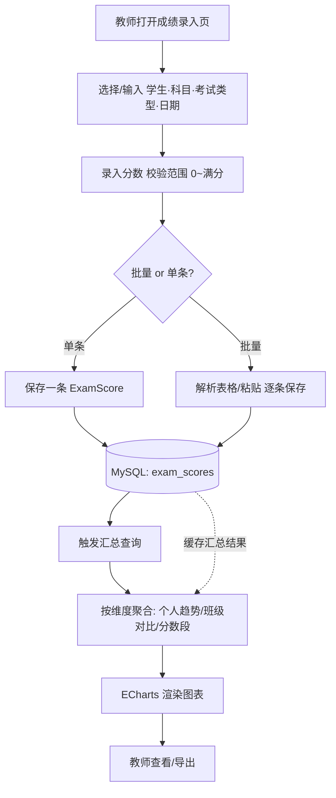

# 学生成绩记录与可视化功能 — 分析设计文档

> 适用范围：数学老师综合管理后台（单用户、个人使用场景）
> 技术栈背景：前端 Vue 3 + Vite + Element Plus + ECharts；后端 Node + Express + Sequelize + MySQL。
> 本文为**分析设计文档，不含实现代码**，用于明确功能边界、数据模型与模块划分，供后续开发参考。

---

## 0. 背景与定位

现有系统已具备：学生信息增删改查、题库管理、作业布置（Homework）与作业打分（Submission，含 `score` 字段）。

本次功能聚焦**正式测评成绩**（期末考试、期中考试、小测、随堂测验等），与「作业练习分」在语义上区分：

- **作业分（已有）**：`Homework` + `Submission`，按作业下发，反映练习完成情况。
- **测评成绩（新增）**：本文所述，按「学生 × 考试场次 × 科目」记录，强调趋势追踪与横向对比。

二者可独立存在，亦可在「成绩总览」中合并展示（作业分作为平时成绩，测评分作为考试成绩）。

---

## 1. 功能目标与用户角色

### 1.1 功能目标

| 目标 | 说明 |
| --- | --- |
| 成绩录入与保存 | 教师每次考试/小测后，快速录入并持久化每位学生的成绩，支持批量与单条。 |
| 自动汇总 | 系统聚合所有已记录成绩，按学生、科目、考试类型、时间段等维度自动计算。 |
| 可视化呈现 | 生成折线图（趋势）、柱状图（对比）、雷达图（能力分布）、饼图（分数段）等。 |
| 辅助决策 | 通过趋势与对比，帮助教师识别薄弱环节、跟踪学生成长。 |
| 轻量易用 | 符合个人使用场景，界面精简，录入路径短，无需复杂权限体系。 |
| 导出与反馈 | 曲线图可导出为图片/数据，并生成面向家长的反馈单（趋势图+小结），便于转发沟通。 |

### 1.2 用户角色

| 角色 | 权限 | 说明 |
| --- | --- | --- |
| 教师（主角色） | 全部功能 | 唯一操作者：录入、编辑、删除成绩，查看所有图表。 |
| 学生（可选只读） | 仅查看本人成绩与趋势 | 若将来开放给学生端，仅能看自己的成绩曲线，无录入/编辑权。当前单用户版本可暂不实现。 |

> 设计原则：以教师为唯一可信数据源，避免多角色带来的复杂度；学生端作为可选扩展。

---

## 2. 核心业务流程

整体链路：**成绩录入 → 数据存储 → 汇总计算 → 图表生成 → 前端渲染**。

### 2.1 各阶段说明

1. **成绩录入**：表单选择学生（下拉，按姓名）、科目、考试类型、日期，输入分数；支持从表格粘贴批量导入（类似现有 `student.import` 的 Map + 批量写思路）。
2. **数据存储**：写入 `exam_scores` 表，关联 `students.id`（见第 3 节）。
3. **汇总计算**：查询时按维度聚合（个人时间序列、班级平均分、分数段计数等），结果可加短 TTL 缓存（复用现有 `utils/cache.js` 思路）。
4. **图表生成**：后端返回聚合数据，前端用 ECharts 渲染；图表配置与数据解耦，便于复用。
5. **渲染、导出与反馈**：教师查看图表；支持将曲线图导出为高清 PNG / 数据导出 Excel；并一键生成「家长反馈单」（趋势图 + 文字小结 + 教师评语），供转发给家长。

---

## 3. 所需数据字段

### 3.1 学生表（已有，无需扩展）

> 场景说明：用户为网课家教老师，学生来自不同学校/地区，**不使用学号**；学生以系统内的 `id` + 姓名标识即可。

| 字段 | 类型 | 必填 | 说明 |
| --- | --- | --- | --- |
| id | INT (PK) | 是 | 学生唯一标识（系统内） |
| name | VARCHAR(50) | 是 | 学生姓名 |
| grade | VARCHAR(50) | 否 | 年级 |
| contact | VARCHAR(100) | 否 | 联系方式 |
| remark | TEXT | 否 | 备注（可记「学校/来源」以区分同名） |

### 3.2 成绩表（新增 `exam_scores`）

| 字段 | 类型 | 必填 | 说明 |
| --- | --- | --- | --- |
| id | INT (PK) | 是 | 记录唯一标识 |
| studentId | INT (FK→students.id) | 是 | 关联学生（通过 id 关联，避免冗余） |
| examType | ENUM('final','mid','quiz','popquiz') | 是 | 考试类型：期末/期中/小测/随堂测验 |
| subject | VARCHAR(50) | 是 | 科目（默认「数学」，可扩展多科） |
| score | FLOAT | 是 | 得分 |
| fullScore | FLOAT | 否 | 满分（默认 100），用于折算百分比 |
| examDate | DATE | 是 | 考试日期 |
| comment | VARCHAR(255) | 否 | 教师备注（如「进步明显」） |
| createdAt / updatedAt | DATETIME | 是 | 时间戳（Sequelize 自动维护） |

> **设计取舍**：学生以系统内的 `studentId` 标识，成绩表只关联 `students.id`，**不与任何外部学号耦合**——契合「学生来自不同学校/地区」的网课家教场景，避免无意义的学号字段。若遇到同名学生，可用现有 `remark` 备注（如「XX学校」）做区分，非必需，也不进成绩表结构。

### 3.3 关键约束

- 分数范围校验：`0 ≤ score ≤ fullScore`，前端输入限制 + 后端二次校验。
- 唯一性：同一 `(studentId, examType, subject, examDate)` 应视为一次考试的一场成绩，重复录入走「更新」而非新增（参考 `student.import` 的 upsert 思路）。
- 索引建议（物理列，注意 `underscored`）：`exam_scores(student_id)`、`exam_scores(exam_date)`、`exam_scores(exam_type)`、`exam_scores(subject)`，加速汇总查询（建索引方式同前次修复，用原生 DDL 避开 alter 索引缺陷）。

---

## 4. 图表类型与展示维度

### 4.1 图表类型

| 图表 | 用途 | 横轴 / 分类 | 纵轴 / 数值 |
| --- | --- | --- | --- |
| 折线图 Line | 单学生某科目**成绩趋势**（多次考试连线） | 考试日期/场次 | 分数（或百分制） |
| 柱状图 Bar | **不同考试/学生对比**（班级同一场考试横向比；或同一学生多科比） | 学生姓名 / 科目 / 考试 | 平均分或单分 |
| 雷达图 Radar | 学生**各科能力分布**（多科目同时看） | 科目维度 | 分数/百分比 |
| 饼图/环形 Pie | **分数段分布**（优秀/良好/及格/不及格占比） | 分数段 | 人数占比 |
| 堆叠条形（可选） | 班级各分数段人数随考试变化 | 考试场次 | 各段人数 |

### 4.2 展示维度（筛选轴）

| 维度 | 取值示例 | 作用 |
| --- | --- | --- |
| 学生维度 | 全部 / 指定学生 | 个人趋势 vs 班级对比 |
| 科目维度 | 数学 / 物理 / … | 单科 or 多科雷达 |
| 考试类型维度 | 期末 / 小测 / … | 区分正式考试与平时小测 |
| 时间维度 | 学期 / 自定义日期区间 | 趋势的时间跨度 |
| 分数段维度 | 优秀(≥90)/良好(80-89)/及格(60-79)/不及格(<60) | 分布统计 |

> 推荐交互：页面顶部放一组筛选器（学生多选、科目、考试类型、日期区间），下方图表随筛选联动刷新；汇总接口接收这些参数返回对应聚合数据。

---

## 5. 模块划分说明

按现有项目结构映射，新增/复用如下模块：

| 层 | 模块/文件（建议） | 职责 |
| --- | --- | --- |
| 数据模型层 | `server/src/models/ExamScore.js`（新增） | 定义成绩表结构与索引；学生表无需改动（不使用学号）。 |
| 服务/控制器层 | `server/src/controllers/grade.controller.js`（新增） | 录入（单条/批量）、查询、按维度汇总、删除；复用 `utils/cache.js` 缓存汇总。 |
| 路由层 | `server/src/routes/grade.routes.js`（新增） | 暴露 `/api/grades` 相关端点（录入、列表、汇总、删除）。 |
| 前端 API 层 | `client/src/api/grade.ts`（新增） | 封装对后端的请求（axios 实例复用现有 `request.ts`）。 |
| 录入视图 | `client/src/views/grade/GradeInput.vue`（新增） | 成绩录入表单 + 批量粘贴导入。 |
| 可视化视图 | `client/src/views/grade/GradeAnalysis.vue`（新增） | 筛选器 + ECharts 图表容器（复用项目已有的 echarts 引入方式）。 |
| 图表组件 | `client/src/components/charts/`（新增，可选） | 封装 LineChart/BarChart/RadarChart/PieChart，接收 `option` 数据，统一主题。 |
| 首页集成 | `client/src/views/Dashboard.vue`（已有，扩展） | 在首页统计区增加「近期成绩概览」入口/卡片，复用 `stats` 聚合思路。 |
| 导出工具 | `client/src/utils/exportChart.ts`（新增） | 封装 ECharts `getDataURL` 导出高清 PNG / 汇总数据导出 CSV。 |
| 反馈单视图 | `client/src/views/grade/GradeFeedback.vue`（新增） | 组装趋势图 + 自动小结 + 教师评语，生成可转发的家长反馈单（图片/打印）。 |

### 5.1 与现有能力的复用点

- **ECharts**：项目已全量引入 echarts，图表直接用，无需新增依赖。
- **Element Plus 表单/表格**：录入与筛选器复用已按需注册的组件。
- **缓存**：汇总接口套用 `utils/cache.js` 的 TTL 缓存，降低重复聚合压力。
- **批量写入**：参考 `student.import` 的「先取全量建 Map + 批量写」思路实现成绩批量导入，避免 N+1。
- **索引建法**：成绩表索引沿用前次修复后的「原生 DDL 在 sync 后补建」方式，规避 `underscored` 下的 alter 索引缺陷。

---

## 6. 关键设计取舍

1. **作业分 vs 测评分分离**：语义清晰、互不污染；总览页可合并展示。
2. **学生以系统内 id 标识**：成绩表仅存 `studentId`，不与学号等外部标识耦合，适配跨校/跨地生源，无冗余字段。
3. **汇总在服务端做**：前端只负责渲染，聚合逻辑（AVG/GROUP BY）放在后端，利于缓存与一致。
4. **图表配置与数据解耦**：图表组件只接收 ECharts `option`，便于复用与单测（未来）。
5. **轻量优先**：单用户场景不做复杂权限、不做多租户；录入路径尽量短。

---

## 7. 非功能考虑

- **性能**：汇总查询加索引 + TTL 缓存；大数据量时汇总接口可做分页或预聚合。
- **数据校验**：分数范围、必填项前后端双校验；批量导入容错（跳过非法行并反馈失败数）。
- **可扩展性**：`examType`/`subject` 用枚举/可配置，未来加科目或考试类型无需改表结构（subject 用 VARCHAR 即可）。
- **可用性**：录入页提供「按考试场次批量填表」模板，降低逐条录入成本。

---

---

## 8. 图表导出与家长反馈

教师完成可视化后，需将结果**对外传递**给家长。本系统提供两类能力：图表导出（自用/留档）与家长反馈单（沟通）。

### 8.1 图表导出

| 方式 | 实现 | 用途 |
| --- | --- | --- |
| 图片导出 | ECharts `getDataURL({ type:'png', pixelRatio:2, backgroundColor:'#fff' })` → Blob → 下载 | 高清曲线图，适合直接转发或留档 |
| 数据导出 | 汇总数据导出为 Excel/CSV（复用现有 `student.export` 思路） | 原始数据存档、二次分析 |
| 打印 / PDF | 提供打印友好样式，浏览器打印另存为 PDF | 正式反馈单纸质版 |

### 8.2 家长反馈单

反馈单 = **趋势图（折线/雷达） + 自动文字小结 + 教师自由评语 + 日期**，仅含该学生数据，不泄露其他学生信息。

- **自动小结**：基于汇总数据生成，例如「近 3 次小测数学平均分 72→88，稳步提升；函数部分仍需加强」。规则可简单用阈值（进步/退步/持平）+ 薄弱科目得出，无需复杂模型。
- **生成方式**：前端将图表 `getDataURL` 与文字渲染到反馈模板（DOM 截图或 canvas 合成），输出为一张可分享图片。
- **发送方式（分层，个人工具优先）**：
  1. **MVP（推荐）**：生成图片后教师自行转发（微信/QQ 等），系统提供「下载图片 / 复制图片」按钮，零对接成本。
  2. **可选增强**：接入邮件或微信模板消息 connector 实现一键发送（需凭证，列为后续扩展，非首版必需）。

### 8.3 模块补充

| 层 | 模块/文件（建议） | 职责 |
| --- | --- | --- |
| 前端工具 | `client/src/utils/exportChart.ts`（新增） | 封装 ECharts 导出 PNG / 数据导出 CSV |
| 前端工具 | `client/src/utils/feedbackTemplate.ts`（新增） | 根据汇总数据生成文字小结模板 |
| 反馈视图 | `client/src/views/grade/GradeFeedback.vue`（新增） | 反馈单预览、生成图片、下载/复制 |
| 后端（可选） | `grade.controller` 增加反馈接口 | 若需服务端渲染 PDF；MVP 阶段前端即可完成，可不改后端 |

---

*文档版本：v1.2 ｜ 更新于 2026-08-23 ｜ 状态：分析设计（待开发确认）｜ 变更：新增「图表导出与家长反馈」章节——导出 PNG/CSV/PDF，家长反馈单（趋势图+自动小结+评语），MVP 采用前端生成图片+老师自行转发。*
